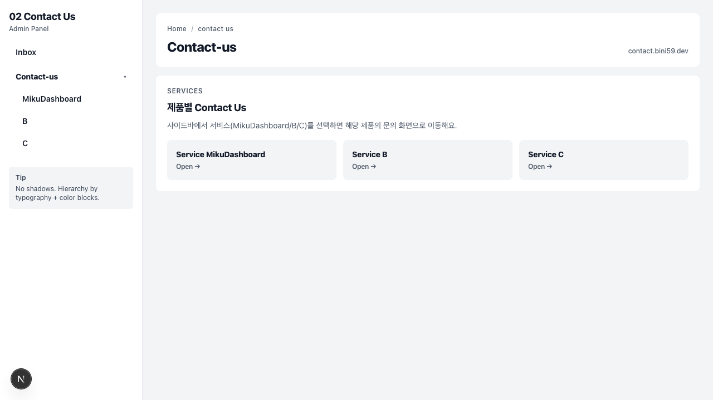

# 🎵 02_contact_us



## 🎤 프로젝트 소개 (Project Intro)

여러 제품/서비스에 대한 고객 문의를 통합 관리하는 **고객 문의(Contact-us) 허브 시스템**입니다. 각 제품별(MikuDashboard, B, C 등) 문의 페이지를 관리하고, 고객이 남긴 문의 사항을 인박스에서 확인할 수 있도록 설계되었습니다. ✨

## 🎹 기술 스택 (Tech Stack)

*   **Framework**: Next.js 16
*   **Language**: TypeScript
*   **Styling**: Tailwind CSS, DaisyUI
*   **Database**: Prisma ORM
*   **Testing**: Vitest, Playwright

## 🚀 빠른 시작 (Quick Start)

```bash
# 의존성 설치
pnpm install

# 개발 서버 실행
pnpm dev
```

## 🌿 브랜치 전략

*   `main`: Production-ready code
*   `dev`: Active development

See: [`docs/BRANCHING.md`](./docs/BRANCHING.md)
